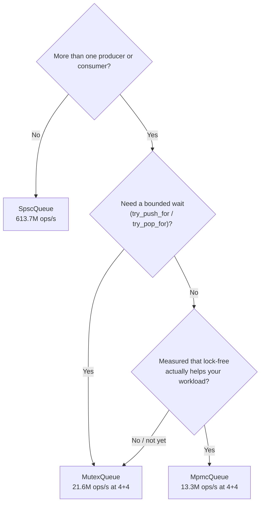
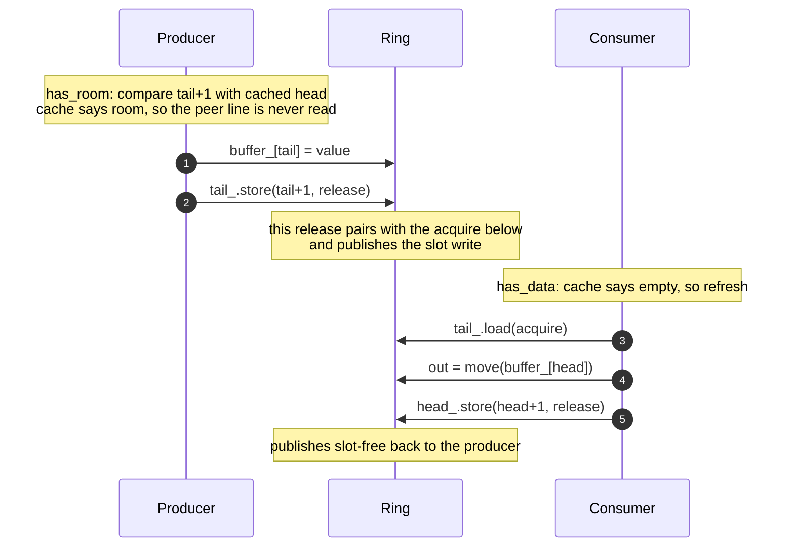
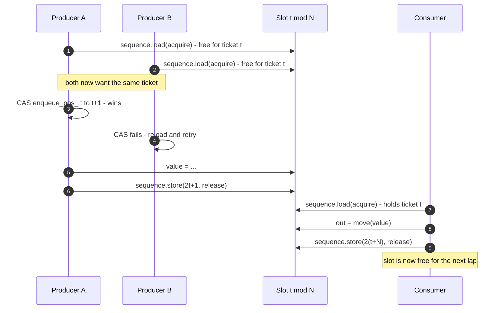

# concurrent-queue

Three bounded, thread-safe FIFO queues in C++20 — a mutex baseline, a lock-free
single-producer/single-consumer ring, and a lock-free multi-producer ring —
each measured against the others.

> Learning project. The deliverable is the measurement: what each design
> actually costs. Full writeups in [docs/results.md](docs/results.md).

## The problem

Hand items from one thread to another without losing, duplicating, or
reordering them — and without letting a fast producer run the machine out of
memory when the consumer falls behind.

A **bounded** queue is the answer: capacity is fixed, and when it fills the
producer waits. That backpressure is the feature. An unbounded queue does not
avoid the problem, it just relocates the failure to the allocator.

## The contract

All three queues promise the same things. Pick between them on threading, not
on behavior.

| | |
|---|---|
| **Order** | FIFO — items leave in the order they arrived |
| **Capacity** | Fixed at construction; never grows |
| **When full** | `push` waits; `try_push` returns `false` |
| **When empty** | `pop` waits; `try_pop` returns `false` |
| **Shutdown** | `close()` refuses new items and wakes every waiter |
| **Draining** | Items already queued still come out after `close()` |
| **Loss** | Nothing accepted is ever dropped, duplicated, or reordered |
| **Element type** | Any `T` that is `DefaultConstructible` and `MoveAssignable` |
| **Lifetime** | The queue must outlive every thread using it |

Every operation returns whether it succeeded, and every one is `[[nodiscard]]`.

## The three queues

They differ in one thing — **how many threads may touch each side** — and the
rest follows from that.

| | `MutexQueue` | `SpscQueue` | `MpmcQueue` |
|---|---|---|---|
| Producer threads | any number | **exactly one** | any number |
| Consumer threads | any number | **exactly one** | any number |
| Exceeding that | — | **undefined behavior, no diagnostic** | — |
| Bounded wait (`try_push_for`) | yes | no | no |
| A waiting thread | sleeps | spins | spins |
| Built from | mutex + condition variables | atomics only | atomics only |



### Why keep both `SpscQueue` and `MpmcQueue`?

`MpmcQueue` can do everything `SpscQueue` can — one producer and one consumer
is just a multi-producer queue with two threads. `SpscQueue` earns its place by
*giving something up*.

When only one thread can write an index, publishing a value is a plain store.
When several might, it becomes an atomic read-modify-write that can lose a race
and have to retry. Nothing else about the two designs differs nearly as much,
and on the one workload both can run, it is worth **2.7×**.

One writer per index — publish, and the other side picks it up:



Several writers per index — claim a ticket first, and lose sometimes:



The two CAS steps — claiming the ticket, and losing the claim — have no
counterpart in the diagram above. Under contention they are where the threads
spend their time.

So: if you only ever want one queue, keep `MpmcQueue`. It is the general one,
and `SpscQueue`'s restriction is enforced only by the contract — break it and
the queue corrupts silently. This repository keeps both because measuring what
the generality costs is the point of it.

## Usage

Header-only. Put `include/` on your include path and include the queue you
picked above.

The canonical producer/consumer shape — this compiles and runs as-is:

```cpp
#include <cq/mutex_queue.hpp>

#include <iostream>
#include <thread>

int main() {
  // Bounded: 64 slots. Declared before the threads, so it outlives them.
  cq::MutexQueue<int> queue(64);
  long long total = 0;

  std::jthread producer([&queue] {
    for (int i = 1; i <= 1000; ++i) {
      if (!queue.push(i)) {  // false => the queue closed; stop early
        return;
      }
    }
    queue.close();  // done producing: lets the consumer drain and exit
  });

  std::jthread consumer([&queue, &total] {
    int value = 0;
    while (queue.pop(value)) {  // false => closed *and* drained
      total += value;
    }
  });

  producer.join();
  consumer.join();
  std::cout << "sum = " << total << '\n';  // 500500
}
```

Two rules are doing the real work there, and both are easy to get wrong:

- **Someone must call `close()`.** `pop` blocks while the queue is empty and
  open, so without a close the consumer waits forever and the program hangs
  instead of exiting. `pop` returns `false` only once the queue is closed
  *and* drained, so closing loses nothing that was already pushed. With
  several producers, join them all before closing.
- **The queue must outlive the threads.** Declaring it before them is enough —
  destruction runs in reverse, so the `jthread`s join first. Destroying a
  queue while a thread sits in `push`/`pop` is undefined behavior.

Every operation is `[[nodiscard]]`, because ignoring whether a push succeeded
is almost always a bug.

### When you cannot afford to block

```cpp
// Never wait: full is your problem to handle.
if (!queue.try_push(item)) {
  ++dropped;  // drop, retry, or push back on whatever produced it
}

// Wait, but not forever (MutexQueue only).
int value = 0;
if (queue.try_pop_for(value, std::chrono::milliseconds(100))) {
  handle(value);
} else if (queue.closed()) {
  // shutting down — stop retrying, close() is one-way
} else {
  // timed out with the queue still empty
}
```

`SpscQueue` and `MpmcQueue` are drop-in for everything above except the timed
`try_*_for` pair, which only `MutexQueue` has. Swapping `MutexQueue` for
`SpscQueue` in the first example is a one-line change — just make sure exactly
one thread touches each side, since nothing checks it for you.

## Performance

Apple M2 Pro, Release build, 10 repetitions. Throughput in ops/s, where an
**op** is one `push` or one `pop` — so moving an item costs two. Higher is
better.

| | `MutexQueue` | `SpscQueue` | `MpmcQueue` |
|---|---|---|---|
| Single thread, push then pop | 105.1M | **1.56G** | 286M |
| 1 producer + 1 consumer | 35.7M | **613.7M** | 224M |
| 4 producers + 4 consumers | **21.6M** | not supported | 13.3M |

Two things worth knowing before you choose:

- **`SpscQueue` is ~17× the mutex** on the one shape it supports. If your
  topology really is one-to-one, that is the whole argument for it.
- **`MpmcQueue` loses to the mutex on 4+4** — 13.3M against 21.6M. Lock-free
  buys progress guarantees, not throughput. Under contention its threads retry
  while the mutex's threads sleep.

Error bars, per-op costs, the conditions each figure was taken under, and the
reasoning behind them: [docs/results.md](docs/results.md).

## Build & test

```sh
# tests (ThreadSanitizer on)
cmake -B build-tsan -DENABLE_TSAN=ON -DCMAKE_BUILD_TYPE=Debug
cmake --build build-tsan && ctest --test-dir build-tsan --output-on-failure

# benchmarks (Release, no sanitizers)
cmake -B build-rel -DCMAKE_BUILD_TYPE=Release
cmake --build build-rel && ./build-rel/bench/queue_bench --benchmark_repetitions=10

# lint (same file sets CI checks; CI pins version 18, so match it locally
# — a different major version formats differently and CI will disagree)
git ls-files '*.hpp' '*.ipp' '*.cpp' | xargs clang-format --dry-run --Werror
git ls-files '*.cpp' | xargs clang-tidy -p build-rel
```

## Correctness policy

- Every test runs under ThreadSanitizer.
- A checksum stress test (N producers push known values; consumers' totals
  must reconcile) gates every queue variant.
- Benchmark numbers are reported as mean ± stddev over repeated runs, with
  machine specs.

## Layout

```
include/cq/     header-only queue implementations
tests/          GoogleTest unit + stress tests (run under ThreadSanitizer)
bench/          Google Benchmark throughput / latency benchmarks
docs/           benchmark writeups
```

## Where this is going

Next is a comparison against `moodycamel::ConcurrentQueue` and
`tbb::concurrent_bounded_queue` on the same benchmarks, then a thread pool
built on `MpmcQueue`.
