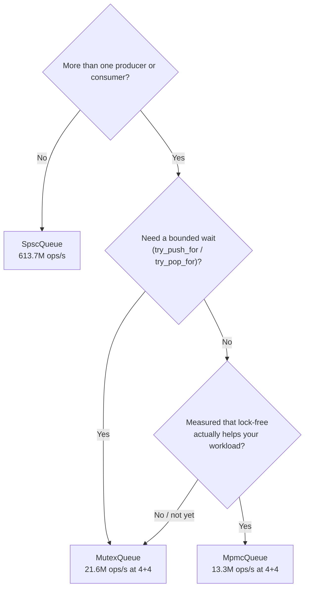
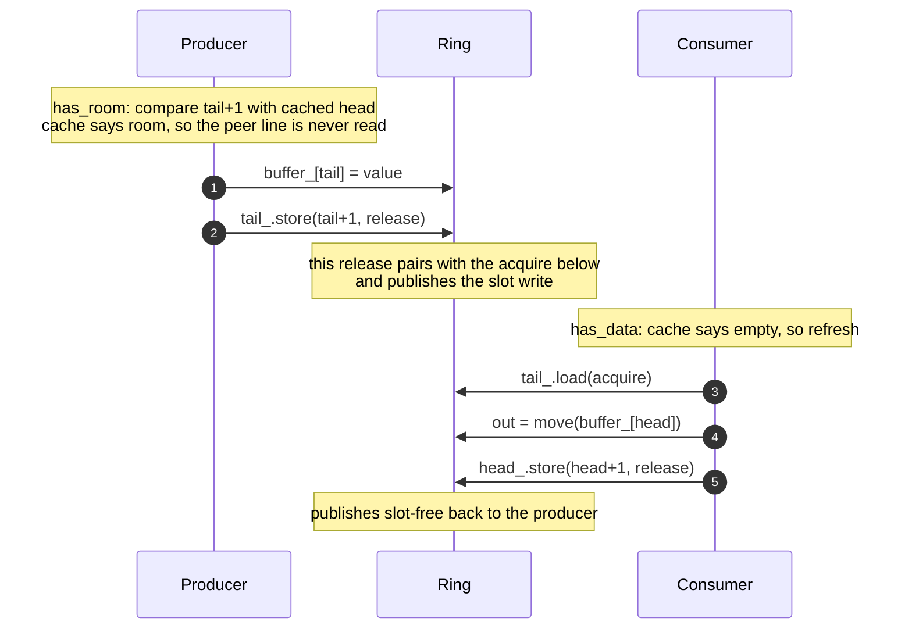
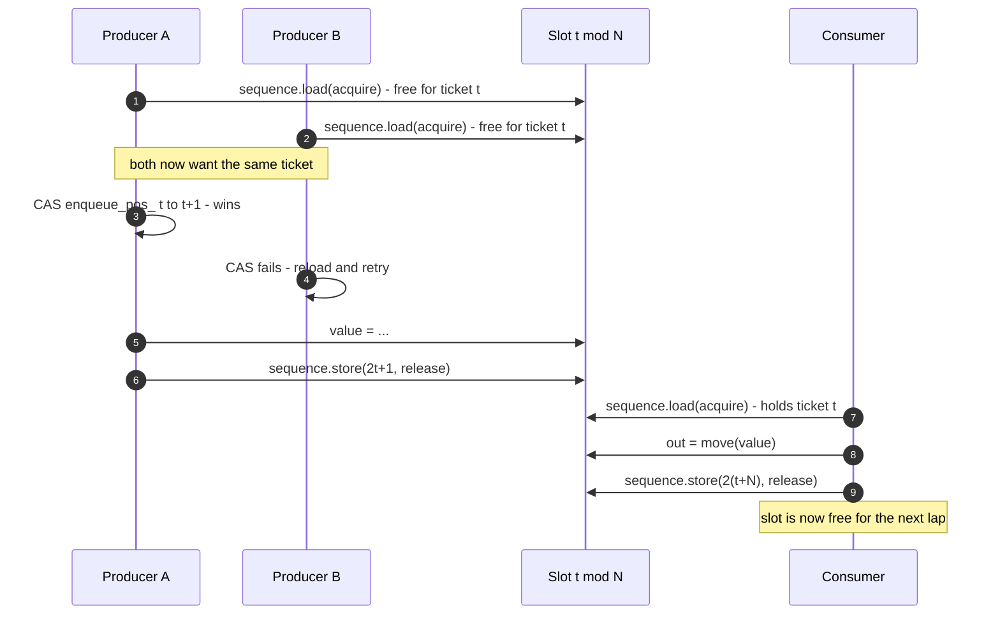

# concurrent-queue

Learning project: build concurrent queues in C++20 from a locked baseline up to
lock-free, benchmark each step honestly, and compare the result against
industrial implementations.

> The main deliverable of this repo is the **benchmark writeup** (numbers,
> graphs, and the reasons behind them) — the code exists to produce it.

## Roadmap

- ✅ **v1 — mutex + condition_variable queue.** Bounded ring storage guarded by a
  `std::mutex`, with `not_full` / `not_empty` condition variables and
  `close()` shutdown semantics. The correctness and performance baseline.
  Each operation offers three waiting disciplines — wait indefinitely
  (`push` / `pop`), never wait (`try_push` / `try_pop`), or wait up to a
  caller-supplied bound (`try_push_for` / `try_pop_for`).
- ✅ **v2 — lock-free SPSC ring buffer with atomics.** Same ring storage, no
  lock. Measure the difference against v1 with Google Benchmark.
- ✅ **v2.1 — cached peer indices.** Each side caches the opposite index so a
  steady stream never reads the peer's cache line.
- ✅ **v2.5 — bounded MPMC queue** (Vyukov-style, per-slot sequence counters).
- ✅ **v3 — compare against moodycamel and TBB.** Run the same benchmarks against
  `moodycamel::ConcurrentQueue` and `tbb::concurrent_bounded_queue`, then
  write up why mine loses (or wins).
- ⬜ **Stretch — a thread pool** on top of the MPMC queue.

## Choosing a queue



| You have | Use | Why |
|---|---|---|
| Any number of threads on either side | `MutexQueue` | Simplest contract; the only one with timed `try_*_for` operations |
| Exactly one producer **and** one consumer | `SpscQueue` | ~2.7× the throughput of `MpmcQueue` on that shape |
| Any number of threads, and you want lock-free | `MpmcQueue` | Progress guarantees without a mutex — but see the numbers before assuming it is faster |

### Why both SPSC and MPMC?

`MpmcQueue` subsumes `SpscQueue` functionally — one producer and one consumer
is just an MPMC queue with two threads. The reason both exist is that dropping
the multi-thread requirement removes the need for **any atomic
read-modify-write** on the hot path:

| | `SpscQueue` (v2.1) | `MpmcQueue` (v2.5) |
|---|---|---|
| Producer / consumer threads | **exactly one each** | any number |
| More than one per side | **undefined behavior**, no diagnostic | supported |
| Publishing an index | plain load + release-store | **CAS** on a position counter shared by that side |
| Retries under contention | never — nothing to contend on | CAS loop, plus a slot-sequence re-check |
| Per-slot state | none | one sequence counter per slot |
| Hot cache lines | 2, one owned by each side | position counters, contended by every thread on that side |
| Throughput, 1 producer + 1 consumer | **613.7M ops/s** | 224M ops/s |
| Throughput, 4 producers + 4 consumers | not supported | 13.3M ops/s |

The two protocols side by side. `SpscQueue` — one writer per index, so the
only synchronization is a release store paired with an acquire load, and the
cached index means most operations never issue that load at all:



`MpmcQueue` — the position counter is shared, so claiming a ticket is a CAS
that can lose, and the handoff moves to a per-slot sequence counter:



Steps 5 and 6 are the whole story: they do not exist in the SPSC diagram, and
under contention they are what every thread spends its time on.

If you only ever want one queue, keep `MpmcQueue` — it is the general one, and
two implementations means two sets of bugs plus a restriction enforced only by
the contract, so breaking it corrupts the queue with no diagnostic. This
repository keeps both because measuring what that generality costs is the
point of it.

## Usage

Header-only. Put `include/` on your include path and include the queue you
picked above.

The canonical producer/consumer shape — this compiles and runs as-is:

```cpp
#include <cq/mutex_queue.hpp>

#include <iostream>
#include <thread>

int main() {
  // Bounded: 64 slots. Declared before the threads, so it outlives them.
  cq::MutexQueue<int> queue(64);
  long long total = 0;

  std::jthread producer([&queue] {
    for (int i = 1; i <= 1000; ++i) {
      if (!queue.push(i)) {  // false => the queue closed; stop early
        return;
      }
    }
    queue.close();  // done producing: lets the consumer drain and exit
  });

  std::jthread consumer([&queue, &total] {
    int value = 0;
    while (queue.pop(value)) {  // false => closed *and* drained
      total += value;
    }
  });

  producer.join();
  consumer.join();
  std::cout << "sum = " << total << '\n';  // 500500
}
```

Two rules are doing the real work there, and both are easy to get wrong:

- **Someone must call `close()`.** `pop` blocks while the queue is empty and
  open, so without a close the consumer waits forever and the program hangs
  instead of exiting. `pop` returns `false` only once the queue is closed
  *and* drained, so closing loses nothing that was already pushed. With
  several producers, join them all before closing.
- **The queue must outlive the threads.** Declaring it before them is enough —
  destruction runs in reverse, so the `jthread`s join first. Destroying a
  queue while a thread sits in `push`/`pop` is undefined behavior.

Every operation is `[[nodiscard]]`, because ignoring whether a push succeeded
is almost always a bug.

### When you cannot afford to block

```cpp
// Never wait: full is your problem to handle.
if (!queue.try_push(item)) {
  ++dropped;  // drop, retry, or push back on whatever produced it
}

// Wait, but not forever (MutexQueue only).
int value = 0;
if (queue.try_pop_for(value, std::chrono::milliseconds(100))) {
  handle(value);
} else if (queue.closed()) {
  // shutting down — stop retrying, close() is one-way
} else {
  // timed out with the queue still empty
}
```

`SpscQueue` and `MpmcQueue` are drop-in for everything above except the timed
`try_*_for` pair, which only `MutexQueue` has. Swapping `MutexQueue` for
`SpscQueue` in the first example is a one-line change — just make sure exactly
one thread touches each side, since nothing checks it for you.

## Layout

```
include/cq/     header-only queue implementations
tests/          GoogleTest unit + stress tests (run under ThreadSanitizer)
bench/          Google Benchmark throughput / latency benchmarks
```

## Build & test

```sh
# tests (ThreadSanitizer on)
cmake -B build-tsan -DENABLE_TSAN=ON -DCMAKE_BUILD_TYPE=Debug
cmake --build build-tsan && ctest --test-dir build-tsan --output-on-failure

# benchmarks (Release, no sanitizers)
cmake -B build-rel -DCMAKE_BUILD_TYPE=Release
cmake --build build-rel && ./build-rel/bench/queue_bench --benchmark_repetitions=10

# lint (same file sets CI checks; CI pins version 18, so match it locally
# — a different major version formats differently and CI will disagree)
git ls-files '*.hpp' '*.ipp' '*.cpp' | xargs clang-format --dry-run --Werror
git ls-files '*.cpp' | xargs clang-tidy -p build-rel
```

## Correctness policy

- Every test runs under ThreadSanitizer.
- A checksum stress test (N producers push known values; consumers' totals
  must reconcile) gates every queue variant.
- Benchmark numbers are reported as mean ± stddev over repeated runs, with
  machine specs.

## Results

Machine: Apple M2 Pro (12 cores), 32 GB, macOS 26. Release build,
`--benchmark_repetitions=10` (each run is `MinTime` 1s, set on the benchmark).
The machine was not idle — load average ~4.6 — so treat these as a floor.

An **op** is one `push` or one `pop`, so transferring an item costs two ops;
this is the unit Google Benchmark prints as `items_per_second`.

Every queue against every benchmark shape, higher is better. The per-version
sections below carry the error bars, the per-op costs, and the reasoning.

| Benchmark shape | v1 `MutexQueue` | v2 `SpscQueue` | v2.1 `SpscQueue` | v2.5 `MpmcQueue` |
|---|---|---|---|---|
| single-thread push+pop round trip | 105.1M | **2.00G** | 1.56G | 286M |
| SPSC — 1 producer, 1 consumer | 35.7M | 369M | **613.7M** | 224M |
| MPMC — 4 producers, 4 consumers | **21.6M** | not supported | not supported | 13.3M |

Two results stand out, both of them the uncomfortable kind:

- **Lock-free lost the shape it was built for.** On 4+4, `MpmcQueue` (13.3M)
  is *slower than the v1 mutex* (21.6M). Lock-free buys progress guarantees,
  not throughput.
- **The v2.1 optimization is not free.** Caching the peer index won 1.70× on
  the SPSC pair but cost 23% on the single-thread round trip, which is the
  cache's worst case.

These columns come from several sessions rather than one run; each section
below states which controls it re-ran and how closely they reproduced, which
is what makes them comparable.

Per-op figures below are `1 / throughput` — the aggregate cost of one op across
the whole queue, not per-thread latency.

| Benchmark (v1 MutexQueue) | Throughput | Per op | CV |
|---|---|---|---|
| single-thread push+pop round trip | 105.1M ± 0.7M ops/s | 9.5 ns (19.0 ns per round trip) | 2.2% |
| SPSC (1 producer, 1 consumer) | 35.7M ± 0.5M ops/s | 28.0 ns | 1.4% |
| MPMC (4 producers, 4 consumers) | 21.6M ± 0.1M ops/s | 46.3 ns | 0.5% |

The v1 story in one line: one mutex serializes everything, so **threads never
buy throughput** — the uncontended round trip moves ops ~3× faster than two
threads managing it, and going from 2 threads to 8 loses a further ~40%
(1.65× slower). That is the baseline v2's lock-free ring has to beat.

Two caveats on reading these numbers. First, v1 notifies its condition
variables on every op, even when no thread is waiting: a variant that keeps
waiter counts and skips the no-op notify measures ~20% faster on MPMC and
~26–37% faster on SPSC (the uncontended round trip is unchanged). This
baseline is deliberately the *simple* single-mutex design, not the fastest
one — worth remembering before crediting v2 with the whole gap. Second, the
numbers above are ops/s; halve them for items transferred per second
(SPSC ≈ 17.9M items/s, MPMC ≈ 10.8M).

### v2 — SpscQueue (lock-free SPSC ring)

Same machine and harness, measured in one session with v1 re-run alongside
(load average ~4.1; v1's SPSC figure reproduced at 35.8M ± 0.6M ops/s, within
noise of the table above — the ratios below use the same-session numbers). An
earlier session on a busier machine recorded 252M ± 55M for the SPSC pair with
a 21.9% CV; the spread was the tell, and the re-measured figures below replace
it.

| Benchmark (v2 SpscQueue) | Throughput | Per op | CV |
|---|---|---|---|
| single-thread push+pop round trip | 2.00G ± 0.01G ops/s | 0.50 ns (1.00 ns per round trip) | 0.7% |
| SPSC (1 producer, 1 consumer) | 369M ± 14M ops/s | 2.7 ns | 3.9% |

The v2 story: dropping the mutex buys **~10× on the SPSC pair** (369M vs
35.8M ops/s) and **~19× on the uncontended round trip**, where an op is a
handful of instructions with no atomic read-modify-write — each side loads the
other side's index and release-stores its own. The new cost center is the
cache coherence traffic itself: the same ring that moves 2.00G ops/s on one
core drops to 369M when producer and consumer sit on different cores and the
`head_`/`tail_` lines ping-pong between them. Caching the last-seen peer index
skips most of those loads; that is v2.1, next section — these figures are the
unoptimized gap it is measured against.

### v2.1 — cached peer indices

Same machine and harness. v2 was rebuilt from its own commit and run
alternately with v2.1 in one session (load average ~4.9), so both columns come
from the same conditions, and v1 ran inside both binaries as a control —
reproducing within 2% (35.4M vs 36.3M ops/s on SPSC), which is what makes the
comparison below worth reading.

The change: each side keeps a private, non-atomic copy of the last value it
read from the opposite index and consults that before touching the real one.
Because both indices only ever advance, a cached value that says "not full" /
"not empty" cannot be wrong — so a steady stream never reads the peer's cache
line at all, and only a ring that has actually run empty or full pays to
refresh.

| Benchmark | v2 | v2.1 | change |
|---|---|---|---|
| SPSC (1 producer, 1 consumer) | 361.7M ± 10.9M ops/s (5.53 ns, CV 3.0%) | **613.7M ± 6.3M ops/s** (3.26 ns, CV 1.0%) | **1.70× faster** |
| single-thread push+pop round trip | 2.006G ± 0.005G ops/s (0.998 ns, CV 0.2%) | 1.555G ± 0.005G ops/s (1.29 ns, CV 0.3%) | **0.77× — 23% slower** |

The optimization does what it was meant to on the benchmark that reflects the
queue's purpose, and it costs something real on the one that does not. That
regression is not incidental. The round-trip benchmark pushes one item and
immediately pops it, so the ring sits pinned at empty and *every* pop finds
its cache stale: it pays the extra compare and the write-back on every single
operation and never once gets to skip a peer read. That is precisely the
cache's worst case. A ring with slack — the SPSC benchmark, and any real
stream — skips nearly all of them. Worth stating plainly rather than quoting
only the number that flatters the change.

The v2 column here (361.7M ops/s) independently agrees with the re-measured
figure in the v2 table above (369M ± 14M), from a separate session. Against
the same-session v1 baseline, **v2 is ~10× v1** and **v2.1 is ~17×** (613.7M
vs 35.4M ops/s).

Where the remaining time goes: at 3.26 ns per op the pair is dominated by the
handoff itself — the producer's release store to `tail_` still has to reach the
consumer's core before the consumer can advance, and no amount of caching
removes that dependency. Publishing an index once per batch of N items is what
buys the next factor, and it trades latency to get it.

### v2.5 — MpmcQueue (Vyukov bounded MPMC)

Same machine and harness, one session containing v1, v2.1, and v2.5 (load
average ~5–6); the controls reproduced their tables above within noise (v1
SPSC 36.2M vs 36.3M, v2.1 SPSC 621.6M vs 613.7M ops/s), which is what makes
the columns comparable.

The design is Dmitry Vyukov's bounded MPMC queue: each slot carries its own
sequence counter and the two position counters only hand out tickets, so
producers synchronize with consumers per slot rather than through one shared
index pair. Two deviations from the canonical version, both for contract
parity with the other queues: capacity is arbitrary (indexing by modulo, not
a power-of-two mask), and the sequence encoding is doubled — free = 2·ticket,
full = 2·ticket + 1 — because the classic encoding collides at capacity 1,
where "holds ticket t's data" and "free for ticket t+1" are the same number.

| Benchmark (v2.5 MpmcQueue) | Throughput | vs v1 same shape | CV |
|---|---|---|---|
| single-thread push+pop round trip | 286M ± 1M ops/s | 2.7× | 0.3% |
| 2 threads (1 producer, 1 consumer) | 224M ± 4M ops/s | 6.2× | 1.6% |
| 8 threads (4 producers, 4 consumers) | **13.3M ± 0.6M ops/s** | **0.62× — slower than the mutex** | 4.3% |

The result worth stating plainly: on the MPMC shape this queue exists for, it
**loses to the v1 mutex baseline** (13.3M vs 21.6M ops/s), while winning the
shapes with little or no contention. A mechanistic reading (from the shape of
the numbers, not from profiling): every operation is an atomic RMW on one of
two position counters that all eight threads hammer, plus a slot-sequence
handoff — under full contention the CAS retry traffic thrashes exactly the
cache lines the SPSC ring so carefully avoided, whereas the mutex serializes
politely through one futex and the losers sleep instead of retrying. The v3
comparison finds the same on this machine for `tbb::concurrent_bounded_queue`,
which is also ticket-based, and it is why moodycamel gives each producer its
own sub-queue instead of one shared ring. Lock-free buys
progress guarantees, not throughput.

### v3 — versus the industry (moodycamel, TBB)

The whole family against two industrial queues, one binary, one session
(moodycamel v1.0.4, oneTBB v2022.2.0; load ~4); every control reproduced its
table above within noise. Read against the contracts: tbb's bounded queue
matches ours; `moodycamel::ConcurrentQueue` is **unbounded** and FIFO only
**per producer** — an easier question, counting the same ops.

| ops/s, mean ± stddev | v1 mutex | v2.1 SPSC | v2.5 MPMC | tbb bounded | moodycamel |
|---|---|---|---|---|---|
| single-thread round trip | 104.5M ± 0.2M | 1.54G ± 0.01G | 277.7M ± 0.8M | 113.3M ± 0.4M | 165.8M ± 1.9M |
| 2 threads (1p + 1c) | 34.2M ± 0.4M | **602M ± 11M** | 216.2M ± 4.7M | 22.6M ± 2.0M | 78.9M ± 2.6M |
| 8 threads (4p + 4c) | **21.0M ± 0.2M** | — | 13.6M ± 0.7M | 16.5M ± 0.5M | **43.5M ± 2.9M** |

Three findings:

**On the MPMC shape, the ranking is moodycamel > mutex > TBB > our Vyukov.**
The queue built for the MPMC job finishes last on it, and both ticket-based
designs lose to a plain mutex: every ticketed op is an atomic RMW on a counter
all eight threads hammer, and the CAS retry traffic (inferred, not profiled)
costs more than the mutex's futex queue, where losers sleep. moodycamel
escapes structurally — a sub-queue per producer — and pays with the weaker
per-producer-FIFO contract.

**With little contention, the specialized designs win big.** Our SPSC ring
at 1p+1c (602M ops/s) is 7.6× moodycamel and 27× TBB; even our Vyukov at
1p+1c (216M) is 2.7× moodycamel. Specializing to the actual concurrency shape
buys more than generic cleverness.

**Nobody beats the mutex at 4p+4c except moodycamel — by changing the
contract.** What lock-free bought this repo: big wins where contention is
structurally limited, progress guarantees everywhere, a throughput *loss*
under real MPMC contention. "Why mine loses": ours keeps global FIFO and
bounded semantics on one shared ring; the winner gave those up.

As everywhere above, these are ops/s — halve for items/s.

_Roadmap complete through v3. Stretch (a thread pool) remains._
