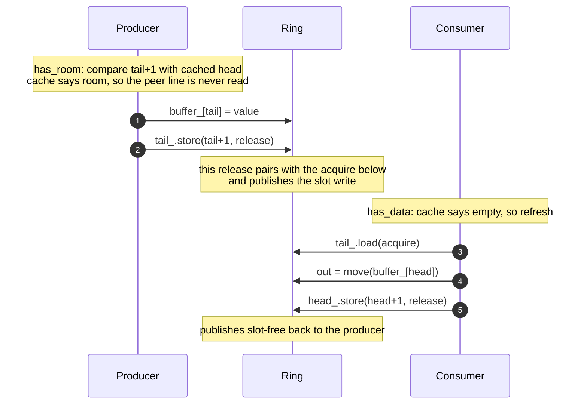
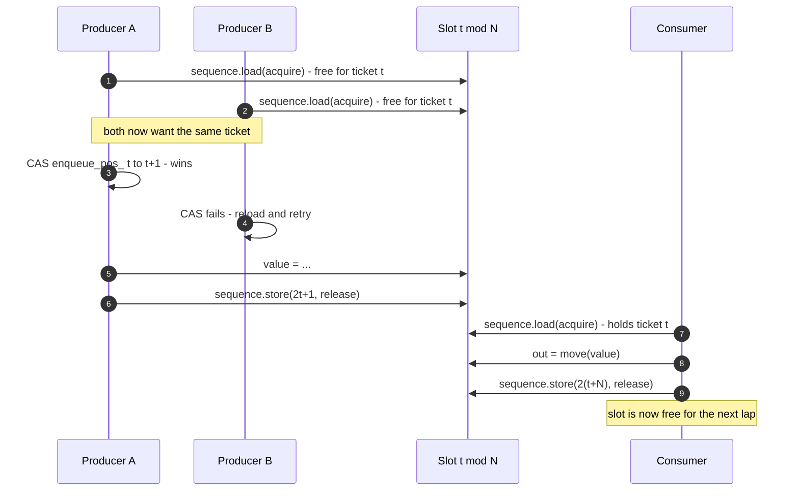

# How they work

Why `SpscQueue` is faster than `MpmcQueue` on the workload both support, in
two diagrams.

## One writer per index

`SpscQueue`. The producer owns `tail_`, the consumer owns `head_`. Because
only one thread ever writes an index, publishing is a plain release store and
reading it is a plain acquire load — no atomic read-modify-write anywhere on
the hot path. Each side also caches the other's index, so a steady stream
mostly avoids reading the peer's cache line at all.

## Several writers per index

`MpmcQueue`, Vyukov's bounded design. A side claims a ticket by CAS-ing a
position counter it shares with every other thread on that side, so the claim
can lose and have to retry. The handoff then runs through a sequence counter
carried by each slot rather than through the shared indices.

The two CAS steps — claiming the ticket, and losing the claim — have no
counterpart in the first diagram. Under contention they are where the threads
spend their time, and they are why `MpmcQueue` loses the 4+4 benchmark to a
plain mutex.

Two deviations from Vyukov's original, both for parity with the other queues:
capacity is arbitrary rather than a power of two (indexing by modulo, not a
mask), and the sequence encoding is doubled — free = 2·ticket, full =
2·ticket + 1 — because the classic encoding collides at capacity 1, where
"holds ticket t's data" and "free for ticket t+1" are the same number.
